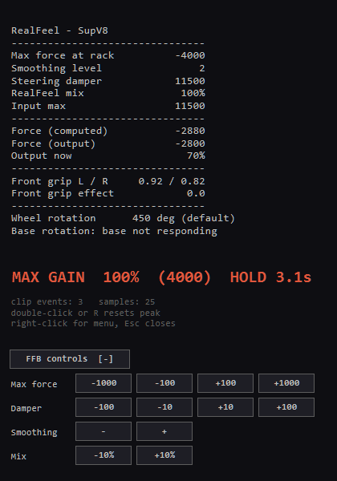

# AMS 1 FFB monitor

An overlay for **Automobilista 1** that reads the RealFeel plugin's console and
shows its values with labels — always the latest line — plus a peak-hold MAX
GAIN, buttons for RealFeel's hotkeys (no numpad or Right Ctrl needed), and
automatic MOZA wheel rotation to match the car's setup.

Built for a **MOZA R5**, but nothing except the rotation feature is
wheel-specific. Requires the game in borderless windowed mode
(`Config.ini`: `WindowedMode=1`, `WindowBorders=0`) and `ConsoleEnabled=True`
in `RealFeelPlugin.ini`.

## Files

| File | What it does |
|---|---|
| `realfeel-overlay.ps1` | The monitor. Compiles `realfeel-overlay.exe` beside itself and launches it. |
| `rotation-watcher.ps1` | Maintenance only: `-Probe` reads the base, `-Restore` puts it back. |
| `pin-realfeel-console.ps1` | Alternative: pins RealFeel's own raw console on top of the game. |
| `tools/fake-realfeel.ps1` | A fake console that prints RealFeel-format lines, for testing without the game. |
| `tools/shoot-running.ps1` | Captures the running overlay to a PNG, for checking layout. |

The `.exe` is not versioned — it is rebuilt whenever the `.ps1` is newer.

## Usage

    powershell -NoProfile -ExecutionPolicy Bypass -File realfeel-overlay.ps1

Options: `-Corner TopRight|TopLeft|BottomRight|BottomLeft`, `-StartExpanded`,
`-ClipThreshold 100`, `-ClipHoldSeconds 4`, `-PollMs 100`, `-HoldMs 150`,
`-IniPath <RealFeelPlugin.ini>`.

Drag to move the window. Double-click or `R` resets the peak. `Esc` closes.
`FFB controls [+]` expands the buttons.

## Why it builds an exe

Reading another process's console requires `AttachConsole`, and a process can
only be attached to one console at a time — so it must `FreeConsole` first.
`powershell.exe` is a console application whose host exits the moment its
console goes away, so a PowerShell-hosted overlay kills itself as soon as it
attaches. Compiling to a Windows-subsystem exe avoids having a console to lose.
It is not about performance.

## What MAX GAIN measures

`Force (output) / MaxForceAtSteeringRack`, verified against the console's own
arithmetic. This is saturation at the **RealFeel stage**, *before* `output max`,
`FFB Gain` and Pit House. So 78% does **not** mean the wheelbase has headroom,
and changing Pit House strength will not move this number. It is the only stage
measurable from outside — no MOZA API exposes actual torque.

When a sample reaches the threshold (`-ClipThreshold`, default 100) the peak
freezes on screen for `-ClipHoldSeconds` and is then cleared, so you can sweep a
whole lap and find every clipping point instead of only the first. `clip events`
counts rising edges — one long slide counts once, even if the hold expires and
re-arms during it. `samples` is the raw count of samples at the threshold.

## Buttons (RealFeel's hotkey map)

    Ctrl + Num 7/8/9   Max force   down / reverse / up
    Ctrl + Num 4/5/6   Damper      down / reset / up
    Ctrl + Num 1/2/3   Mix         -10% / toggle / +10%
    RCtrl + Num 0/.    Smoothing   down / up

Right Ctrl is the fine step, Left Ctrl the coarse one. Sources contradict each
other about the damper step sizes, so every button reports the delta it actually
produced rather than trusting its own label.

Input is injected with `SendInput` — RealFeel reads the keyboard only through
`GetKeyState`, and `PostMessage` does not update the state that reads. The
overlay has `WS_EX_NOACTIVATE`, which is what makes this possible: clicking its
buttons does not take focus away from the game. It only sends when AMS is in the
foreground and telemetry is present, since the hotkeys work on track only.

**Unverified in the real game:** whether `GetKeyState` inside the plugin sees
injected input. Everything else here is tested against `tools/fake-realfeel.ps1`.

## Testing without the game

    powershell -NoProfile -ExecutionPolicy Bypass -File tools\fake-realfeel.ps1
    powershell -NoProfile -ExecutionPolicy Bypass -File realfeel-overlay.ps1 -SelfTest -TestPid <fake pid>

`-SelfTest` reads five samples, parses them and prints the result, without
building the exe.

## MOZA rotation, per car setup

Built into the overlay — one application. It adds two rows, `Wheel rotation`
(what the car wants) and `Base rotation` (the wheelbase's own setting), and
writes the car's rotation to the base.

The value comes from the **live setup**, `tempGarage.svm`, next to the profile's
`Controller.ini`:

    [CONTROLS]
    SteeringRotationSetting=2//380.0 deg

The game resolves the degrees into the comment itself, so there is no index
table to maintain. A leading `//` means that is the car's default — but the line
still carries the correct degrees and must be read all the same.

Treating a commented line as "nothing set" was the cause of "sometimes it
doesn't pick up the latest value": choosing the default makes the game comment
the line out, which fell back to `Controller.ini` — and that file is **always
one change behind**. Measured 2026-09-20:

    06:46:47  setup 430 (explicit)   ini 450   <- the previous value
    06:46:53  setup 380 (explicit)   ini 430   <- the previous value
    06:47:00  setup 450 (default)    ini 380   <- the previous value

So the setup wins, commented or not. `Controller.ini` is only a fallback when
there is no rotation line at all, and the row says where the number came from:
`(setup)`, `(default)` or `(car)`. It triggers on the **value** changing, never
on the timestamp — both files are rewritten every few seconds with identical
contents.

### The SDK

Needs the MOZA SDK DLLs in `lib\moza\` — not versioned here, as the zip ships no
licence: `MOZA_API_CSharp.dll`, `MOZA_API_C.dll`, `MOZA_SDK.dll`, from
`SDK_CSharp\x64\` inside `MOZA_SDK.zip`
([mozaracing.com/pages/sdk](https://mozaracing.com/pages/sdk), ~54 MB).

The SDK is called by **reflection** on purpose: with a compile-time reference, a
missing DLL would fail the entire overlay's build and you would lose the FFB
monitor over an optional extra. If the DLLs are absent, rotation simply turns
itself off and says why on screen.

    setMotorLimitAngle(limitAngle, gameMaximumAngle)

MOZA documents `gameMaximumAngle` as `90-limitAngle`, implying it may be lower.
On the R5 it may **not** — the two must be **equal**. Measured 2026-09-20, every
mismatched pair is rejected with `OUTOFRANGE`:

    set(1100, 380) -> OUTOFRANGE      set(1100,1100) -> NORMAL
    set( 900, 380) -> OUTOFRANGE      set( 540, 540) -> NORMAL
    set(1080, 540) -> OUTOFRANGE
    set(2000, 380) -> OUTOFRANGE

So there is no ceiling to raise: the wanted rotation is written into both,
`setMotorLimitAngle(N, N)`, capped at `-MaxLimit` (1080). The original state is
saved to `rotation-watcher-state.json` on first connect and restored when the
game closes and when the overlay closes.

The base passes through three states while connecting: `NODEVICES`, then
`NORMAL` with zeros, and finally `NORMAL` with the real value. The middle one
lies, so only a reading of 90 degrees or more is accepted (the SDK's own
documented minimum). It takes about three seconds. Every write is read back and
verified, because MOZA's own example calls `setMotorLimitAngle(150,200)` — which
violates their documented constraint.

    -RotationDryRun   show the rows but never write to the base
    -NoRotation       disable rotation entirely; the FFB monitor is unaffected
    -ProfileIni       the profile's Controller.ini (found automatically)
    -MozaLib          folder holding the DLLs (default lib\moza)
    -MaxLimit 1080    cap on the rotation written to the base
